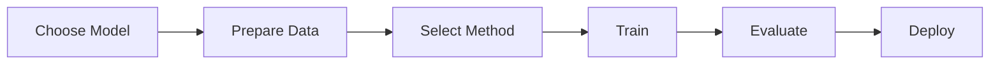

<div align="center">

# 🚀 LLM Engineering Hub

### *Your Complete Guide to Large Language Model Engineering*

[](./LICENSE)
[](.)
[](.)
[](./README.md#contributing)

**A comprehensive, free, and open-source knowledge repository for mastering Large Language Models**

*From beginner to expert • Research to Production • Theory to Practice*

---

### 🎯 Quick Navigation

[📚 Tutorials](#-tutorials) • [📄 Research Papers](#-research-papers) • [🗃️ Datasets](#-datasets) • [🛠️ Tools](#️-tools--libraries)

[⚙️ Fine-Tuning](#️-fine-tuning) • [🎨 Prompts](#-prompt-engineering) • [☁️ Deployment](#️-deployment) • [⚖️ Ethics](#️-ethics--safety)

[💼 Case Studies](#-case-studies) • [📊 Visualizations](#-visualizations) • [🌐 Community](#-community-resources)

</div>

---

## 📖 Table of Contents

- [✨ About](#-about-this-repository)
- [ Quick Start](#-quick-start-guide)
- [🎓 Learning Paths](#-learning-paths)
- [📂 Content Sections](#-content-sections)
- [✨ Key Features](#-key-features)
- [📖 How to Use](#-how-to-use-this-repository)
- [🤝 Contributing](#-contributing)

---

## 🎯 About This Repository

Welcome to **LLM Engineering Hub** - the most comprehensive, free, and community-driven guide to mastering Large Language Models. Whether you're taking your first steps into AI or pushing the boundaries of research, this repository is your trusted companion.

### 🌟 What Makes This Special

<table>
<tr>
<td width="50%">

**📚 Complete Learning Journey**
- Start from absolute basics
- Progress to cutting-edge research
- No gaps in your knowledge

**🎯 Practical Focus**
- Real tools you can use today
- Production deployment guides
- Industry case studies

**🌍 Community-Powered**
- Curated by practitioners
- Regular updates
- Open to contributions

</td>
<td width="50%">

**� Quality Guaranteed**
- 100+ research papers reviewed
- 1000+ resources curated
- Zero commercial content

**⚡ Always Current**
- Latest research & tools
- New techniques added regularly
- Active maintenance

**♿ Accessible to All**
- Free forever
- Clear explanations
- Multiple learning formats

</td>
</tr>
</table>

### 🎁 What's Inside

| Section | What You Get | Time Investment |
|---------|--------------|-----------------|
| � **Tutorials** | 3 skill levels, step-by-step guides | Beginner: 2-4 weeks |
| 📄 **Research** | 100+ curated papers with summaries | Read 2-3 per week |
| 🗃️ **Datasets** | 50+ free datasets, ready to use | Explore as needed |
| 🛠️ **Tools** | Complete ecosystem map | 1-2 weeks to survey |
| ⚙️ **Fine-Tuning** | End-to-end guides with examples | 1-2 weeks practice |
| 🎨 **Prompts** | Techniques + ready templates | 1 week to master |
| ☁️ **Deployment** | Free & paid options compared | 1 week to decide |
| ⚖️ **Ethics** | Responsible AI frameworks | Ongoing practice |
| 💼 **Case Studies** | 20+ real implementations | Learn from others |
| 📊 **Visualizations** | Diagrams, charts, interactive tools | Visual learning |
| 🌐 **Community** | Forums, channels, events | Stay connected |

### 🎯 Our Mission

> **To democratize LLM knowledge and make cutting-edge AI technology accessible to everyone, regardless of background, resources, or location.**

We believe that:
- 💡 Knowledge should be free
- 🤝 Community makes us stronger
- 🌍 AI should benefit everyone
- 📚 Quality education is a right
- 🔬 Open research accelerates progress

### 👥 Who This Is For

✅ **Students & Beginners** - Start your AI journey  
✅ **Developers** - Build LLM applications  
✅ **ML Engineers** - Transition to LLMs  
✅ **Researchers** - Access latest papers  
✅ **Data Scientists** - Leverage LLMs  
✅ **Product Managers** - Understand capabilities  
✅ **Educators** - Teaching resources  
✅ **Entrepreneurs** - Build AI products

---

## 🚀 Quick Start Guide

### For Beginners
1. Start with **[Tutorials/Beginner/](./Tutorials/Beginner/)** to understand LLM fundamentals
2. Explore **[Visualizations/](./Visualizations/)** for visual explanations
3. Check out **[Community-Resources/](./Community-Resources/)** to connect with learners

### For Intermediate Learners
1. Review **[Tutorials/Intermediate/](./Tutorials/Intermediate/)** for advanced concepts
2. Study **[Research-Papers/Model-Architecture/](./Research-Papers/Model-Architecture/)** to understand design choices
3. Experiment with **[Datasets/](./Datasets/)** and **[Tools-and-Libraries/](./Tools-and-Libraries/)**
4. Practice **[Prompt-Engineering/](./Prompt-Engineering/)** techniques

### For Advanced Practitioners
1. Deep dive into **[Tutorials/Advanced/](./Tutorials/Advanced/)**
2. Read cutting-edge papers in **[Research-Papers/](./Research-Papers/)**
3. Master **[Fine-Tuning/](./Fine-Tuning/)** and **[Deployment/](./Deployment/)** strategies
4. Study **[Case-Studies/](./Case-Studies/)** for real-world insights
5. Contribute to **[Ethics-and-Safety/](./Ethics-and-Safety/)** discussions

---

## 📂 Content Sections

### 📚 Tutorials

**[📂 View All Tutorials](./Tutorials/)**

Comprehensive learning paths organized by skill level to guide you from fundamentals to advanced topics.

<table>
<tr>
<td width="33%" valign="top">

#### 🌱 [Beginner](./Tutorials/Beginner/)
Perfect for those new to LLMs

**What You'll Learn:**
- Introduction to LLMs
- Understanding Transformers
- Tokenization basics
- Pre-trained models
- Basic prompt engineering
- Model parameters
- Free tools & platforms

**Time Commitment:** 2-4 weeks

</td>
<td width="33%" valign="top">

#### 🌿 [Intermediate](./Tutorials/Intermediate/)
For practitioners ready to dive deeper

**What You'll Learn:**
- Advanced prompt engineering
- Fine-tuning fundamentals
- RAG (Retrieval-Augmented Generation)
- Model evaluation
- Architecture comparisons
- Optimization techniques
- Multimodal models
- LLM frameworks

**Time Commitment:** 4-8 weeks

</td>
<td width="33%" valign="top">

#### 🌳 [Advanced](./Tutorials/Advanced/)
For experts & researchers

**What You'll Learn:**
- Large-scale training
- RLHF & alignment
- Mixture of Experts (MoE)
- Constitutional AI
- Mechanistic interpretability
- Long context windows
- Efficient architectures
- Agent systems
- Research frontiers

**Time Commitment:** Ongoing

</td>
</tr>
</table>

---

### 📄 Research Papers

**[📂 View All Research Papers](./Research-Papers/)**

Curated collection of groundbreaking papers that shaped the field of LLMs.

| Category | Focus | Key Papers |
|----------|-------|------------|
| **[🏗️ Model Architecture](./Research-Papers/Model-Architecture/)** | Transformer designs, model innovations | Attention Is All You Need, GPT, BERT, LLaMA, Mistral, Mixtral |
| **[🎯 Training Techniques](./Research-Papers/Training-Techniques/)** | Optimization, scaling, efficiency | Scaling Laws, Chinchilla, Adam, LoRA, QLoRA, FSDP |
| **[📊 Evaluation](./Research-Papers/Evaluation/)** | Benchmarks, metrics, safety | MMLU, HellaSwag, HumanEval, TruthfulQA, HELM |

**Total Papers:** 100+ carefully selected and categorized

---

### 🗃️ Datasets

**[📂 View All Datasets](./Datasets/)**

Free, open-source datasets for training, fine-tuning, and evaluating LLMs.

<details>
<summary><b>🔵 Pre-Training Datasets</b></summary>

- **The Pile** - 825GB diverse text corpus
- **C4 (Colossal Clean Crawled Corpus)** - Web-scale dataset
- **RedPajama** - Open reproduction of LLaMA training data
- **Dolma** - 3 trillion tokens from Allen AI
- **ROOTS** - Multilingual dataset (1.6TB)

</details>

<details>
<summary><b>🟢 Instruction Tuning Datasets</b></summary>

- **Alpaca** - 52K instruction-following examples
- **Dolly-15k** - Human-generated instructions
- **OpenAssistant Conversations** - Multi-turn dialogues
- **FLAN Collection** - Task-formatted datasets
- **ShareGPT** - Real ChatGPT conversations

</details>

<details>
<summary><b>🟡 Benchmark Datasets</b></summary>

- **MMLU** - Massive multitask language understanding
- **HellaSwag** - Commonsense reasoning
- **HumanEval** - Code generation evaluation
- **TruthfulQA** - Truthfulness assessment
- **GSM8K** - Grade school math problems

</details>

<details>
<summary><b>🟣 Domain-Specific Datasets</b></summary>

- **PubMedQA** - Biomedical question answering
- **MultiLegalPile** - Legal documents
- **FinancialPhraseBank** - Financial sentiment
- **CodeSearchNet** - Code & documentation
- **SciQ** - Science questions

</details>

**[➡️ Explore All Datasets](./Datasets/)**

---

### 🛠️ Tools & Libraries

**[📂 View All Tools](./Tools-and-Libraries/)**

Complete ecosystem of open-source frameworks, libraries, and platforms for LLM work.

| Category | Tools | Use Case |
|----------|-------|----------|
| **🤗 Model Libraries** | Transformers, PEFT, TRL, Diffusers | Loading, training, fine-tuning models |
| **⚡ Training Frameworks** | DeepSpeed, Megatron-LM, FSDP, Accelerate | Distributed training, optimization |
| **🚀 Inference Engines** | vLLM, TGI, llama.cpp, Ollama, ExLlamaV2 | Fast inference, serving, local deployment |
| **🔗 Application Frameworks** | LangChain, LlamaIndex, Haystack, Semantic Kernel | Building LLM applications, RAG |
| **💾 Vector Databases** | Chroma, Weaviate, Qdrant, Pinecone, FAISS | Embeddings storage, semantic search |
| **📊 Evaluation Tools** | Eval Harness, OpenAI Evals, BIG-bench | Benchmarking, testing |
| **☁️ Platforms** | Hugging Face, Replicate, Modal, RunPod | Hosting, deployment, APIs |

**[➡️ Explore All Tools](./Tools-and-Libraries/)**

---

### ⚙️ Fine-Tuning

**[📂 View Fine-Tuning Guide](./Fine-Tuning/)**

Complete guides for customizing LLMs to your specific needs.



**Methods Covered:**
- **LoRA** (Low-Rank Adaptation) - Efficient fine-tuning
- **QLoRA** - 4-bit quantized LoRA
- **Full Fine-Tuning** - Complete model adaptation
- **Prefix Tuning** - Soft prompts
- **Adapter Methods** - Modular fine-tuning

**What You'll Learn:**
- When to fine-tune vs. prompt
- Data preparation & formatting
- Hyperparameter tuning
- Training process & monitoring
- Evaluation strategies
- Best practices & pitfalls

**[➡️ Start Fine-Tuning](./Fine-Tuning/)**

---

### 🎨 Prompt Engineering

**[📂 View Prompt Engineering Guide](./Prompt-Engineering/)**

Master the art and science of crafting effective prompts for LLMs.

**📖 Techniques:**

<table>
<tr>
<td width="50%">

**Basic Techniques**
- ✏️ Clear instructions
- 🔢 Few-shot learning
- 0️⃣ Zero-shot prompting
- 🎭 Role assignment
- 📋 Output formatting

</td>
<td width="50%">

**Advanced Techniques**
- 🧠 Chain-of-Thought (CoT)
- 🔄 Self-consistency
- 🌳 Tree of Thoughts (ToT)
- ⚡ ReAct (Reasoning + Acting)
- 🎯 Self-ask prompting

</td>
</tr>
</table>

**📝 Ready-to-Use Templates:**
- Question answering
- Summarization
- Code generation
- Data extraction
- Creative writing
- Translation

**[➡️ Learn Prompt Engineering](./Prompt-Engineering/)**

---

### ☁️ Deployment

**[📂 View Deployment Guide](./Deployment/)**

Production-ready strategies for deploying LLMs at scale.

**Deployment Options:**

| Option | Cost | Control | Scalability | Use Case |
|--------|------|---------|-------------|----------|
| **🏠 Self-Hosted** | Low | High | Medium | Privacy, customization |
| **☁️ Cloud Platforms** | Medium-High | Medium | High | Production apps |
| **🔌 API Services** | Pay-per-use | Low | High | Quick prototypes |
| **💻 Local Development** | Free | Full | Low | Testing, learning |

**Tools & Platforms:**
- **Ollama** - Run LLMs locally
- **vLLM** - High-performance serving
- **Text Generation Inference (TGI)** - Hugging Face serving
- **AWS SageMaker**, **Google Vertex AI**, **Azure OpenAI**
- **Hugging Face Spaces** - Free hosting for demos

**Topics Covered:**
- Inference optimization
- Quantization (4-bit, 8-bit)
- Cost optimization
- Monitoring & logging
- Security best practices
- Scaling strategies

**[➡️ Deploy Your LLM](./Deployment/)**

---

### ⚖️ Ethics & Safety

**[📂 View Ethics Guide](./Ethics-and-Safety/)**

Build responsible, safe, and ethical LLM applications.

**Core Principles:**
- 🎯 **Fairness** - Reduce bias and discrimination
- 🔒 **Privacy** - Protect user data
- 🛡️ **Safety** - Prevent harmful outputs
- 📖 **Transparency** - Explainable AI
- ♻️ **Sustainability** - Environmental impact
- ⚖️ **Accountability** - Responsible deployment

**Key Topics:**
- Bias detection & mitigation
- Content filtering & moderation
- Data privacy (GDPR, CCPA compliance)
- Red teaming & adversarial testing
- Model cards & documentation
- Constitutional AI
- Alignment techniques

**Frameworks & Guidelines:**
- EU AI Act
- NIST AI Risk Management
- IEEE Ethics Guidelines
- Partnership on AI

**[➡️ Learn Responsible AI](./Ethics-and-Safety/)**

---

### 💼 Case Studies

**[📂 View All Case Studies](./Case-Studies/)**

Real-world LLM implementations across industries.

**Featured Case Studies:**

🏢 **Enterprise Applications**
- ChatGPT (OpenAI) - Conversational AI at scale
- GitHub Copilot - AI pair programming
- Jasper AI - Content generation
- Notion AI - Productivity assistant

🏥 **Healthcare**
- Med-PaLM 2 - Medical question answering
- Clinical documentation automation
- Drug discovery acceleration

💰 **Finance**
- Bloomberg GPT - Financial analysis
- Fraud detection systems
- Customer service automation

📚 **Education**
- Khan Academy's Khanmigo
- Duolingo Max - Language learning
- Automated grading systems

⚖️ **Legal**
- Contract analysis
- Legal research assistants
- Document review automation

**Learn From:**
- ✅ Success patterns
- ❌ Failure modes
- 💡 Lessons learned
- 📊 Performance metrics

**[➡️ Explore Case Studies](./Case-Studies/)**

---

### 📊 Visualizations

**[📂 View Visualizations](./Visualizations/)**

Visual learning resources to understand LLM concepts better.

**Available Resources:**

📐 **Architecture Visualizations**
- Transformer architecture diagrams
- Attention mechanism illustrations
- Model comparison charts
- Scaling visualizations

🗺️ **Concept Maps**
- LLM ecosystem overview
- Training pipeline flowcharts
- Fine-tuning decision trees
- Deployment architectures

📈 **Performance Visualizations**
- Benchmark comparisons
- Speed vs. accuracy tradeoffs
- Cost analysis charts
- Scaling laws graphs

🎨 **Interactive Tools**
- Transformer Explainer
- LLM Visualization
- BertViz - Attention visualization
- TensorBoard - Training metrics

**[➡️ View Visualizations](./Visualizations/)**

---

### 🌐 Community Resources

**[📂 View Community Resources](./Community-Resources/)**

Connect with the global LLM community.

**💬 Online Communities**
- Reddit: r/MachineLearning, r/LocalLLaMA, r/LanguageTechnology
- Discord: Hugging Face, EleutherAI, LangChain
- Forums: fast.ai, Papers with Code

**📧 Newsletters & Blogs**
- The Batch (Andrew Ng)
- Import AI (Jack Clark)
- Ahead of AI (Sebastian Raschka)
- Jay Alammar's Blog

**🎥 YouTube Channels**
- 3Blue1Brown (Visual math)
- Andrej Karpathy (Deep learning)
- Yannic Kilcher (Paper reviews)
- StatQuest (Statistics)

**🎙️ Podcasts**
- Gradient Dissent
- The TWIML AI Podcast
- Practical AI

**🐦 Twitter/X Follow**
- @karpathy, @ylecun, @goodfellow_ian
- @AndrewYNg, @sebastianraschka
- @_jasonwei, @rasbt

**🎓 Free Courses**
- Fast.ai Practical Deep Learning
- Hugging Face NLP Course
- DeepLearning.AI courses

**🎪 Conferences & Events**
- NeurIPS, ICLR, ACL, EMNLP
- AI meetups & webinars

**[➡️ Join the Community](./Community-Resources/)**

---

## 🎓 Learning Paths

### Path 1: Complete Beginner → Practitioner (3-6 months)
```
Week 1-2:   Beginner Tutorials + Visualizations
Week 3-4:   Basic Prompt Engineering + Tools exploration
Week 5-8:   Intermediate Tutorials + Dataset exploration
Week 9-12:  Fine-Tuning basics + Case Studies
Week 13+:   Advanced topics + Community engagement
```

### Path 2: ML Engineer → LLM Specialist (1-3 months)
```
Week 1:     Intermediate Tutorials + Model Architecture papers
Week 2:     Fine-Tuning guides + Prompt Engineering
Week 3:     Deployment strategies + Tools deep-dive
Week 4+:    Advanced topics + Research Papers + Case Studies
```

### Path 3: Researcher → LLM Expert (Ongoing)
```
Continuous: Research Papers + Advanced Tutorials
Regular:    Ethics & Safety + Evaluation techniques
Active:     Community Resources + Case Studies
```

---

## ✨ Key Features

<table>
<tr>
<td width="50%" valign="top">

### 🆓 100% Free & Open Source
- ✅ Zero paywalls or hidden costs
- ✅ All resources freely accessible
- ✅ Open-source tools only
- ✅ No commercial promotions
- ✅ MIT License - use anywhere

### 📈 Tiered Learning System
- 🌱 **Beginner** - Fundamentals & basics
- 🌿 **Intermediate** - Practical applications
- 🌳 **Advanced** - Research & cutting-edge
- 📊 Clear skill progression paths
- 🎯 Self-paced learning

### 🌍 Community-Driven
- 🤝 Open to all contributions
- 🌈 Diverse perspectives
- 🔄 Regular community updates
- 💬 Active discussions
- 👥 Growing contributor base

</td>
<td width="50%" valign="top">

### 🎯 Practical & Actionable
- 💼 Real-world case studies
- 🛠️ Hands-on tool guides
- ☁️ Production deployment strategies
- 📝 Ready-to-use templates
- 🚀 Quick start guides

### 🔬 Research-Backed
- 📄 100+ curated papers
- 🏆 Top conferences (NeurIPS, ICLR, ACL)
- 🔬 Latest breakthroughs
- 📚 Evidence-based practices
- 🔗 Direct paper links

### ⚖️ Ethics-First Approach
- 🛡️ Responsible AI guidelines
- 🔒 Privacy & security focus
- ⚖️ Bias mitigation strategies
- ✅ Compliance frameworks
- 🌍 Sustainable AI practices

</td>
</tr>
</table>

### 📊 What Makes Us Different

| Feature | This Repository | Others |
|---------|----------------|--------|
| **Cost** | 100% Free | Often paid resources |
| **Structure** | Organized by skill level | Mixed difficulty |
| **Coverage** | End-to-end (theory → production) | Often fragmented |
| **Updates** | Community-driven, regular | Varies |
| **Ethics** | Dedicated section | Often overlooked |
| **Practical** | Tools, deployment, case studies | Mostly theory |
| **Community** | Active & welcoming | Varies |

---

## � How to Use This Repository

### 🧭 Navigation Guide

<details open>
<summary><b>🔍 Finding What You Need</b></summary>

1. **📂 Browse by Topic** - Use the [folder structure](#️-repository-structure) above
2. **🎓 Follow Learning Paths** - Choose based on your [skill level](#-learning-paths)
3. **🔎 Search Function** - Press `Ctrl+F` (Windows) or `Cmd+F` (Mac)
4. **📖 README Files** - Each directory has detailed guides
5. **🗂️ Table of Contents** - Jump to specific [sections](#-table-of-contents)

</details>

<details>
<summary><b>✅ Best Practices for Learning</b></summary>

- ⭐ **Star** this repo to bookmark it
- 👁️ **Watch** for new content updates
- 🔖 **Bookmark** sections you're studying
- 📝 **Take notes** as you learn
- 🧪 **Experiment** with tools hands-on
- 🤝 **Share** with your network
- 💬 **Ask questions** in Discussions
- � **Revisit** topics as you progress

</details>

<details>
<summary><b>📅 Suggested Study Schedule</b></summary>

**Daily (30-60 min):**
- Read one tutorial section
- Review one research paper abstract
- Practice prompt engineering

**Weekly (2-4 hours):**
- Complete one tutorial module
- Experiment with one new tool
- Join a community discussion

**Monthly:**
- Review progress and adjust learning path
- Explore case studies
- Contribute back to the repository

</details>

<details>
<summary><b>🔔 Stay Updated</b></summary>

- 📋 Check [CHANGELOG.md](./CHANGELOG.md) for updates
- 👥 Join [Community Resources](./Community-Resources/) forums
- 📧 Subscribe to recommended newsletters
- 🔔 Enable GitHub notifications
- 🌟 Follow contributors on social media

</details>

### 💡 Pro Tips

> **🎯 Tip 1:** Start with fundamentals even if you have ML experience - LLMs have unique characteristics!

> **🧪 Tip 2:** Theory + Practice = Mastery. Read papers AND experiment with tools.

> **🤝 Tip 3:** Join community discussions - learning is exponentially better together!

> **📚 Tip 4:** Don't rush. Deep understanding beats surface-level knowledge.

> **⚖️ Tip 5:** Ethics isn't optional - integrate responsible AI from day one.

---

## 🤝 Contributing

We welcome contributions from everyone! Whether you're a beginner or an expert, your insights and resources can help others.

### How to Contribute

1. **Fork the repository**
2. **Create a new branch** (`git checkout -b feature/add-new-resource`)
3. **Add your content** following our guidelines
4. **Commit your changes** (`git commit -m 'Add new resource on [topic]'`)
5. **Push to your branch** (`git push origin feature/add-new-resource`)
6. **Open a Pull Request**

### Contribution Guidelines

#### What We're Looking For
- ✅ Free and open-source resources
- ✅ High-quality tutorials and guides
- ✅ Peer-reviewed research papers
- ✅ Open datasets with proper licenses
- ✅ Well-documented tools and libraries
- ✅ Real-world case studies
- ✅ Educational visualizations

#### What We Don't Accept
- ❌ Paid or commercial content
- ❌ Code implementations (this is a knowledge repository)
- ❌ Copyrighted materials without permission
- ❌ Promotional or marketing content
- ❌ Low-quality or unverified resources
- ❌ Duplicate content already in the repository

#### Content Standards
- Provide clear descriptions and summaries
- Include proper citations and attributions
- Tag content with appropriate difficulty levels
- Ensure all links are working and accessible
- Follow the existing formatting and structure
- Add resources to appropriate categories

### Code of Conduct

We are committed to providing a welcoming and inclusive environment. Please:
- Be respectful and considerate
- Welcome diverse perspectives
- Accept constructive criticism
- Focus on what's best for the community
- Show empathy towards others

Unacceptable behavior includes harassment, trolling, insults, or any form of discrimination.

---

## 🌐 Community

### Connect With Us

- **💬 GitHub Discussions**: Ask questions and share insights
- **🐛 Issues**: Report broken links or suggest improvements
- **📧 Mailing List**: Subscribe for monthly updates
- **🌟 Contributors**: See our [Contributors](./CONTRIBUTORS.md) page

### Join the Conversation

Check out [Community-Resources/](./Community-Resources/) for:
- Discord servers and Slack communities
- Reddit communities (r/MachineLearning, r/LocalLLaMA)
- Twitter/X accounts to follow
- YouTube channels and podcasts
- Newsletters and blogs

---

## 📜 License

This repository is licensed under the **MIT License** - see the [LICENSE](./LICENSE) file for details.

### What This Means
- ✅ Free to use, modify, and distribute
- ✅ Can be used for commercial purposes
- ✅ No warranty provided
- ⚠️ Must include original license and copyright notice

### Content Attribution

All external resources linked in this repository are the property of their respective creators. We provide links and summaries under fair use for educational purposes. If you are a content creator and wish to have your work removed, please open an issue.

---

## 🙏 Acknowledgments

This repository is built on the incredible work of:
- The open-source AI community
- Researchers publishing freely accessible papers
- Creators of educational content
- Contributors to open datasets and tools
- Everyone who believes in democratizing AI knowledge

### Special Thanks To
- OpenAI, Google, Meta, Anthropic, and others for open research
- Hugging Face for democratizing AI tools
- ArXiv for free research paper access
- The entire LLM and ML community

---

## 📊 Repository Stats


---

## 🗺️ Roadmap

### Upcoming Additions
- [ ] Video tutorial playlists
- [ ] Interactive learning notebooks
- [ ] Monthly paper summaries
- [ ] LLM comparison charts
- [ ] Interview preparation guides
- [ ] Career pathways in LLM engineering

### How to Suggest Features
Open an issue with the tag `enhancement` and describe your idea!

---

## 💡 Quick Tips

> **Tip 1**: Start with the basics even if you have ML experience - LLMs have unique characteristics!

> **Tip 2**: Don't just read - experiment with the tools and datasets provided.

> **Tip 3**: Join the community - learning is better together!

> **Tip 4**: Focus on understanding concepts before diving into implementation.

> **Tip 5**: Ethics and safety aren't optional - make them part of your learning from day one.

---

<div align="center">

## 🌟 Support This Project

If you find this repository helpful, please consider:

⭐ **Starring** this repository  
🔄 **Sharing** it with your network  
🤝 **Contributing** new resources  
💬 **Joining** the discussions  
📢 **Following** for updates

---

## 📞 Connect

[](https://github.com/VenkataAnilKumar)
[](https://github.com/VenkataAnilKumar/LLM-Engineering/issues)
[](https://github.com/VenkataAnilKumar/LLM-Engineering/discussions)

---

## 📊 Repository Stats


---

## 🗺️ Roadmap

**Coming Soon:**
- [ ] Video tutorial compilations
- [ ] Interactive Jupyter notebooks (educational)
- [ ] Monthly research summaries
- [ ] LLM comparison matrices
- [ ] Interview prep guides
- [ ] Career pathways guide
- [ ] Multilingual translations
- [ ] Community spotlights

**Suggest a Feature:** [Open an Issue](https://github.com/VenkataAnilKumar/LLM-Engineering/issues/new) with the `enhancement` tag

---

## 💡 Did You Know?

> 💭 **Tip of the Day:** The best way to learn LLMs is through a combination of theory (research papers), practice (experiments with tools), and community engagement (discussions and contributions).

---

## 🏆 Contributors

A huge thank you to all our contributors! 🎉

[See our amazing contributors →](./CONTRIBUTORS.md)

**Want to see your name here?** Check out our [Contributing Guide](#-contributing)

---

## 📜 License & Attribution

This repository is licensed under the **[MIT License](./LICENSE)**.

- ✅ Free to use, modify, and distribute
- ✅ Commercial use allowed
- ⚠️ Must include attribution

All linked external resources remain property of their respective creators. Links provided under fair use for educational purposes.

---

## 🙏 Acknowledgments

Built with gratitude for:
- 🧑‍🔬 **Researchers** publishing open papers
- 👨‍💻 **Open-source developers** creating amazing tools
- 👩‍🏫 **Educators** sharing knowledge freely
- 🌍 **The AI community** making technology accessible

**Special Thanks:** OpenAI, Google, Meta, Anthropic, Hugging Face, EleutherAI, and the entire open-source AI community.

---

## 📚 Related Resources

- [Awesome LLM](https://github.com/Hannibal046/Awesome-LLM) - Another great LLM resource collection
- [Awesome ChatGPT Prompts](https://github.com/f/awesome-chatgpt-prompts) - Prompt examples
- [LLM Course](https://github.com/mlabonne/llm-course) - Hands-on LLM course
- [Awesome AI Tools](https://github.com/mahseema/awesome-ai-tools) - AI tools collection

---

<br>

### *"Democratizing LLM Knowledge, One Resource at a Time"*

**Made with ❤️ by the LLM Community for the LLM Community**

**[⬆ Back to Top](#-llm-engineering-hub)**

<br>

---

**Last Updated:** October 2025 | **Version:** 1.0.0 | [📋 Changelog](./CHANGELOG.md)

</div>
